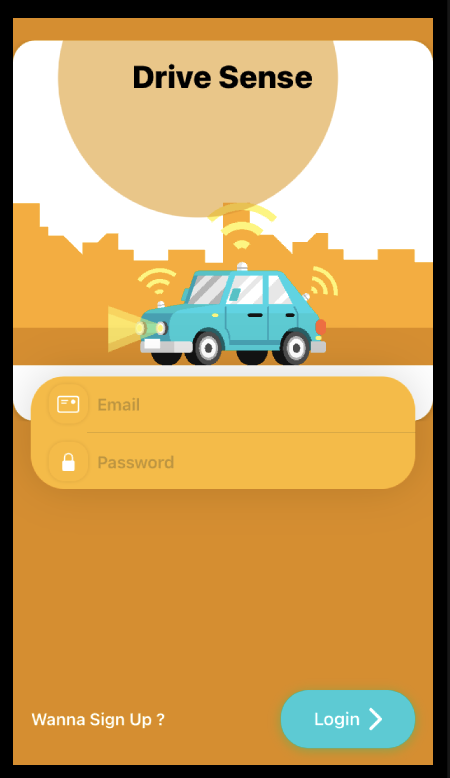
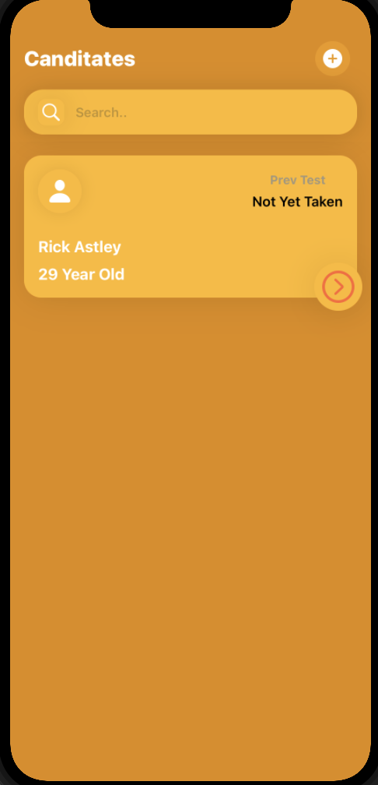
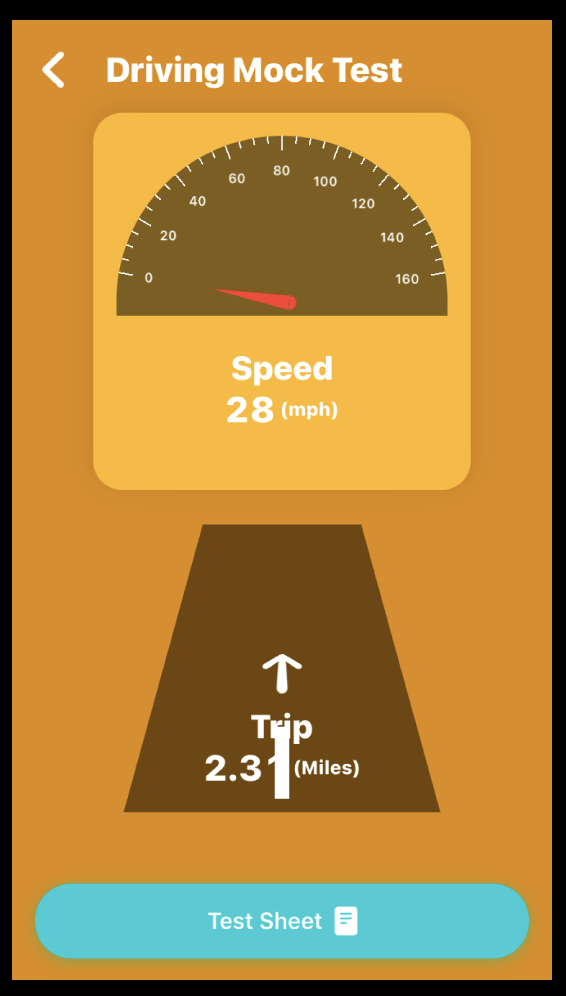
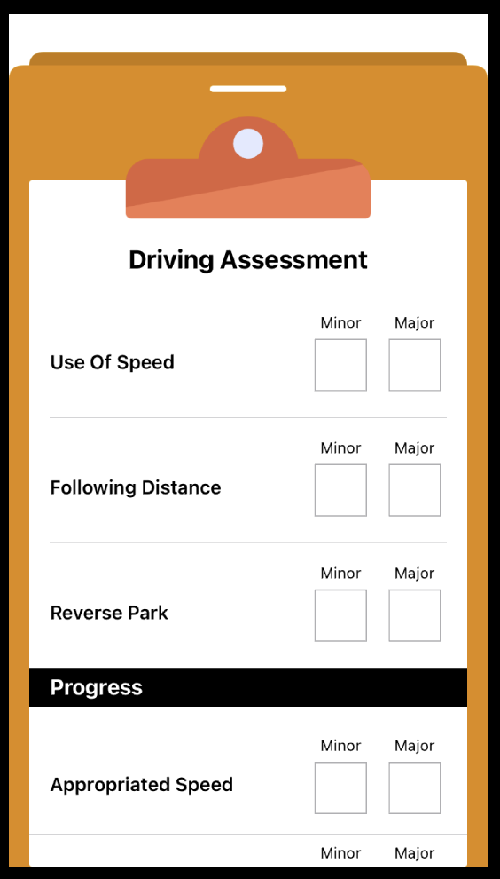

#  DriveSense

## Description

---

Driver training has always been based on the traditional instructor-trainee model where feedback to the driver is provided only through the observations of the instructor. While Internet of Things and data analytics technologies have already been introduced for drivers, especially for insurance (e.g., the car insurance black boxes), the actual process of learning how to drive does not benefit at all from such technologies. In this project, the student will develop a mobile application for gathering a large variety of data (speed variations, sudden brakes etc.) that may or may not be indicative to quality of driving. The app will be given to a driver instructor who will use it with the consent of trainees when conducting mock driver’s license tests.

## Screenshots

---

    

## App Infrastructure

---

We are going to use the Redux architectural pattern for this project in order to learn how it can be used for production applications, what its limitations are, and how things go when the product scales. Swift UI is based on the reactive programming paradigm. Redux has emerged as another clear architectural pattern to follow in IOS. The base infrastructure for a Redux-based application is like this:

 

below is an example of how i have implemented the store for this application.

    protocol Action {}

    typealias Reducer<State> = (State,Action) -> State
    typealias Middleware<State> = (State,Action) -> AnyPublisher<Action,Never>

    final class Store<State>: ObservableObject,ActionDispatcher {

        // MARK: - Properties

        @Published private(set) var state: State

        private var subscription = [UUID : AnyCancellable]()
        private var queue = DispatchQueue(label: "driveSense.dispatch.event", qos: .userInitiated)
        private let reducer: Reducer<State>
        private let middleware: [Middleware<State>]

        init(initial: State,
                reducer: @escaping Reducer<State>,
                middleware: [Middleware<State>]
        ) {
            self.state = initial
            self.reducer = reducer
            self.middleware = middleware
        }

        // MARK: - Methods

        func restore( _ state: State) {
            self.state = state
        }

        func dispatch(_ action: Action) {
            queue.sync {
                dispatch(self.state, action)
            }
        }

        fileprivate func dispatch(_ current: State,_ action: Action) {
            let newState = reducer(current,action)
            middleware.forEach { middleware in
                let key = UUID()
                middleware(newState,action)
                    .receive(on: RunLoop.main)
                    .handleEvents(receiveCompletion: { [weak self] _ in
                        self?.subscription.removeValue(forKey: key)
                    })
                    .sink(receiveValue: dispatch(_:))
                    .store(for: &subscription,key: key)

            }
            self.state = newState
        }

    }

In addition, I came across the Dependency Inversion Container pattern for Dependency Management in many open-source Swift projects and thought it might be useful. It turns out to be helpful in many different ways, but the bonus point is that it enforces clean coding.

## Upcoming

---

- Improving Data Synchronisation Approach and cache policies.
- Converting already decoupled services into frameworks.
- Implement multiple data synchronisation strategies for handling synchronisation failures.
- Integrating UI Testing.
- Providing users with a visual representation of analytics using swift Charts.
